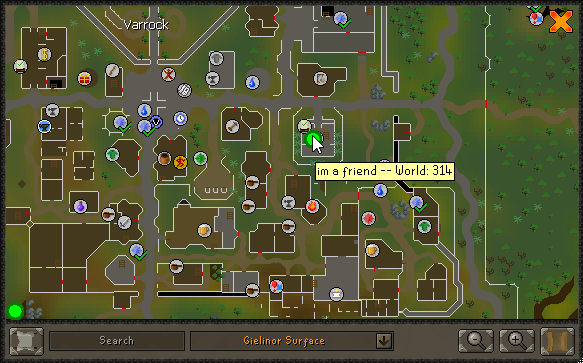

# Runelite Friend Finder
A simple plugin for showing your friends on your world map and visa versa

## Features 
- Send your locations to those on your friends list and receive their location back 
  - NOTE: Both you AND your friend must have the plugin for this to work.
- (Configurable) Double click your friend's point on the map to hop to their world
- Configurable report interval. Have low bandwidth? Set the plugin to only report and update every 30 seconds!
- Configurable point colors and sizes
- See your friends health and prayer statuses in a handy sidebar

Your in-game location will be sent to an external server where it will be store as a single data point for all your friends to pull down and see. Your location is only visible to people on your RuneScape friends list, unless you have a person set as your friend they *cannot* see your location.  

The way the location retrieval of your friends works is they would have to have the this plugin and be also sending their their location to the server for your client to retrieve and then display. Both people must have the plugin for this to work.

## Privacy Information
- Yes, this plugin reaches out to a server I setup to store and deliver your runescape location to and from your friends
- No location history data is stored
- Absolutely _NO_ personal information is sent to the server whatsoever. 
- Your public IP address may briefly be stored in memory for use in DoS protection and general server security.  
- All location data is removed after 90 seconds from last report.